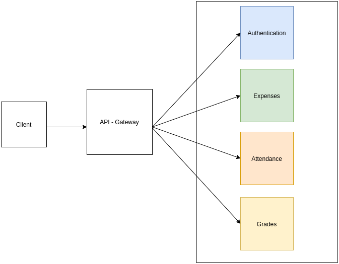

# sidekick

sidekick is a web application that can help college students keep track of their grades, expenses and attendance. 

### Architecture


### Tech Stack
1. Node.js and Express
2. MySQL
3. React 

### Setup
Each microservice is built independently and runs on its separate server.
The API Gateway has its own dedicated server too.
And lastly, during the development phase, our frontend needs a server too.

Go to the root directory of each microservice and create a .env file with the following setup.

```sh
DB_HOST=yourDBHost
DB_USER=yourUser
DB_NAME=SIDEKICK_SERVICE_NAME
DB_PASS=yourPassword
PORT=yourChoice
```
The API-Gateway .env file needs the following configuration.
```sh
PORT=yourChoice
AUTH_PORT=yourChoice
EXPENSES_PORT=yourChoice
ATTENDANCE_PORT=yourChoice
GRADES_PORT=yourChoice
```
Create and setup the databases by running the setup.sql file within each service (serviceName/db/setup.sql)
Finally, npm install for all services.

Turn on the servers and play! 
The frontend is by default running at port 3000 and considers the API-Gateway to be at port 4000. (Check "proxy" in ./web/package.json). 

### Tests
```sh
$ cd tests
$ npm install
$ npm run test-auth
$ npm run test-exp
$ npm run test-attend
$ npm run test-grades
```
### License

